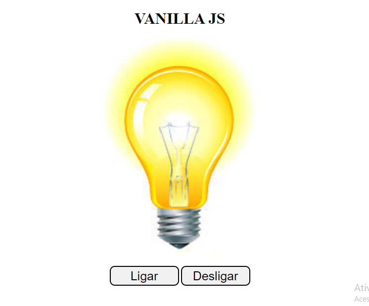

#   Projeto: Lâmpada

## Descrição:
Projeto, click no botão ligar (lâmpada liga), click no botão desligar (lâmpada desliga),
passe o mouse emcima da lâmpada (lâmpada liga), retire o mouse de cima da lâmpada (lâmpada desliga),
click duas vezes emcima da lâmpada (Lâmpada quebra).
Mérito do projeto: Pofessor Fernando Leonid.

[🔗 Clique aqui para acessar](https://marcos-franco.github.io/LampadaJavascript/)

## 🛠 Tecnologias:
- HTML
- CSS
- Javascript
- Git
- Github

## Status do Projeto:
100% Concluído

## Autor:
Projeto desenvolvido por [Marcos Franco](https://www.linkedin.com/in/marcosfranco-5b1a8a111/)

## 💛 Contatos:

Linkedin: https://www.linkedin.com/in/marcosfranco-5b1a8a111/

Repositório Github: https://github.com/marcos-franco

WhatSapp: https://contate.me/marcos-franco

E-mail: masf68@hotmail.com
